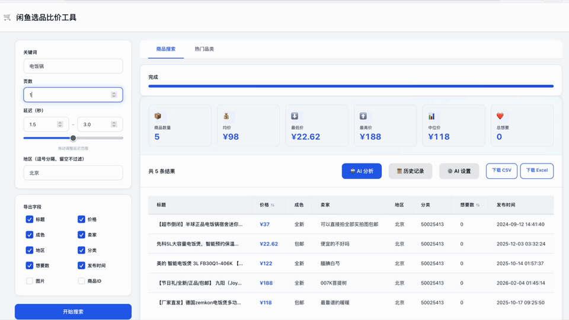

# 闲鱼价格追踪工具



一个用于抓取闲鱼（goofish.com）搜索结果、分析价格区间并导出 CSV / Excel 的开源工具，提供 CLI、Web 和可选 AI 分析能力。

## 一眼看懂

- 登录一次后复用本地会话，减少重复扫码
- 抓取多页搜索结果，支持地区筛选和字段导出
- 自动生成价格统计，适合做二手市场调研
- 提供 Web UI，适合非命令行用户
- 提供 AI / 启发式分析，快速筛选高性价比商品

## 适合谁

- 想研究某类二手商品价格区间的人
- 想批量导出闲鱼搜索结果做表格分析的人
- 想在现有抓取逻辑上继续做提醒、监控或定制功能的人

适合这些场景：

- 二手商品价格调研与比价
- 多页搜索结果采集与导出
- 按地区筛选商品，快速做样本分析
- 本地保存登录会话，减少重复操作

## 为什么用它

- 自动打开浏览器登录并保存会话
- 抓取多页搜索结果，支持请求间隔控制
- 支持地区筛选、自定义导出字段
- 自动生成均价、中位价、最高价、最低价等统计信息
- 支持 AI 对搜索结果做性价比 / 套利潜力分析
- 无 API Key 时仍可使用本地启发式评分
- 同时提供 CLI 和 Web UI，适合脚本化和手动操作

## 3 分钟快速开始

环境要求：

- Python 3.8+
- pip

安装依赖：

```bash
git clone https://github.com/Ray-Yuan21/xianyu-price-tracker.git
cd xianyu-price-tracker
pip install -r requirements.txt
playwright install chromium
```

首次登录：

```bash
python main.py login
```

执行一次搜索：

```bash
python main.py search "iPhone 15" --pages 1
```

启动 Web 界面：

不要用 --reload，改成这样启动
uvicorn server:app --host 127.0.0.1 --port 8000

```bash
uvicorn server:app --reload
```

然后访问 `http://localhost:8000`。

## 核心能力

- CLI 搜索：适合脚本化执行和快速导出
- Web 界面：适合手动登录、查看进度和触发分析
- 价格统计：自动计算均价、中位价、最高价、最低价
- 导出能力：支持 CSV / Excel
- AI 分析：支持 OpenAI 兼容接口、Gemini 和本地启发式回退

## CLI 示例

```bash
# 默认抓取 3 页
python main.py search "MacBook Pro"

# 导出 Excel
python main.py search "AirPods" --format excel

# 地区筛选
python main.py search "Switch" --location "北京,上海,深圳"

# 自定义导出字段
python main.py search "iPad" --fields "title,price,location,seller_nick"
```

导出字段包括：`item_id`、`title`、`price`、`condition`、`seller_nick`、`location`、`category`、`want_count`、`created_time`、`images`。

## AI 分析

项目内置可选 AI 分析流程，适合从搜索结果中快速筛选“高性价比 / 可赚差价”的商品。

- Web 端支持直接配置 AI 参数并发起分析
- 支持 OpenAI 兼容接口，也兼容 Gemini 格式
- 默认分析价格、热度、风险词、交易成本等维度
- 未配置 API Key 时，自动回退到本地启发式评分，不会完全失效

默认配置文件为 `config.json`，可参考 `config.example.json`。核心逻辑位于 `scraper/ai_analyzer.py`，接口位于 `server.py` 的 `/api/config` 和 `/api/analyze`。

## 项目结构

```text
.
├── main.py                # CLI 入口
├── server.py              # FastAPI Web 服务
├── scraper/
│   ├── auth.py            # 登录与会话管理
│   ├── search.py          # 搜索与接口响应捕获
│   ├── parser.py          # 数据解析与去重
│   ├── exporter.py        # CSV / Excel 导出
│   └── ai_analyzer.py     # AI / 启发式分析
├── static/index.html      # Web UI
├── session/               # 本地会话文件
└── data/                  # 导出结果
```

## 工作原理

1. 使用 Playwright 打开浏览器，手动完成闲鱼登录。
2. 本地保存 `session/storage_state.json` 作为登录态。
3. 访问搜索页并拦截 `mtop.taobao.idlemtopsearch.pc.search` 响应。
4. 从 `data.resultList[].data.item.main` 提取商品字段。
5. 可选地对结果做 AI / 启发式分析，再导出为 CSV / Excel。

## 安全说明

- `session/storage_state.json` 包含登录态，不要提交或分享
- `config.json` 可能包含 API Key，不要提交到仓库
- `data/` 中的导出文件可能含有卖家信息，公开前请自行脱敏
- 建议控制抓取频率，避免高频访问

## 贡献

欢迎提交 Issue 和 Pull Request。提交前建议至少完成一次本地验证：

```bash
python -m py_compile main.py server.py scraper/*.py
python main.py search "测试" --pages 1
```

## 支持项目

如果这个项目对你有帮助，可以通过以下方式支持：

- 给仓库点一个 Star
- 提交 Issue / PR 帮忙改进功能
- 通过 Sponsor 支持维护成本
- 联系作者做安装排障、私有部署或定制开发

### 可提供的付费服务

如果你不想自己处理环境、浏览器登录态、接口兼容或二次开发，可以直接联系作者。

- 环境安装与远程配置：帮助你在本地跑通 Python、Playwright、登录和导出流程
- 使用排障与兼容修复：处理登录失效、抓取不到结果、导出异常、接口变动等问题
- 功能定制开发：批量关键词、定时任务、价格提醒、更多筛选条件、导出模板
- 私有部署与二次开发：按你的业务流程接入现有系统或扩展 Web 功能

适合这些用户：

- 想快速跑通闲鱼数据采集，但不想自己排查环境问题
- 已经有明确需求，想在现有项目上继续定制
- 需要私有化使用，不希望自己维护抓取逻辑

联系邮箱：

- `ybr3765@gmail.com`

### 赞助作者

如果这个项目帮你节省了时间，欢迎扫码支持维护：

<p>
  
  
</p>

## License

MIT License. 详见 [LICENSE](LICENSE)。
